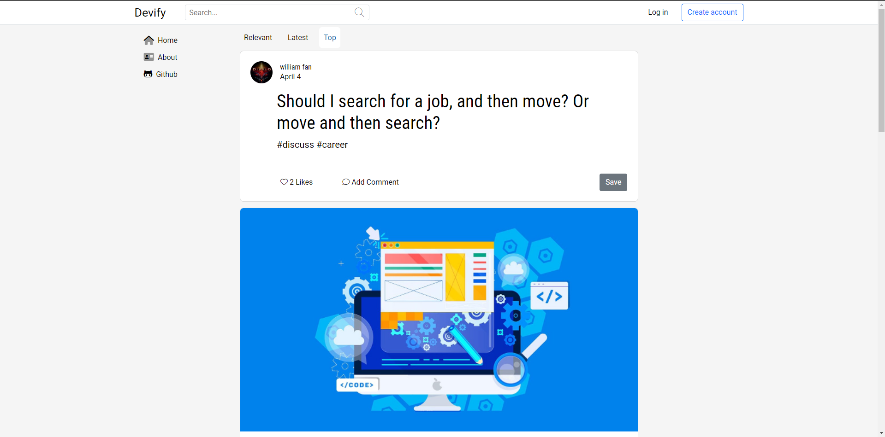
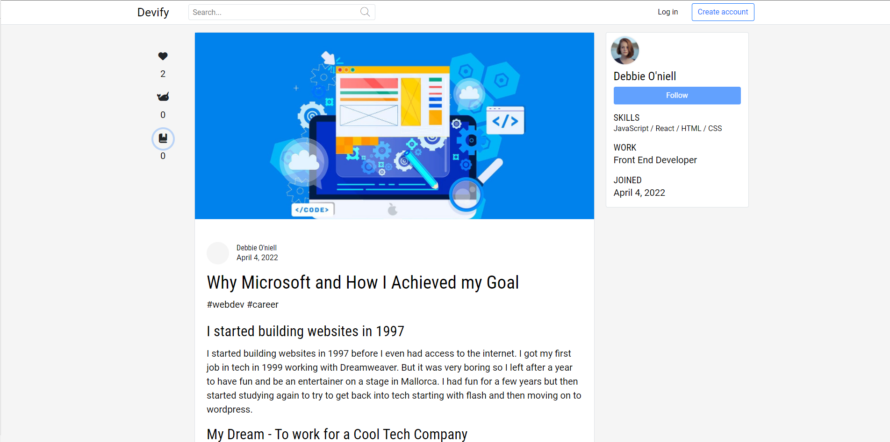

# Devify

- This application was made with HTML, CSS, Bootstrap 5, JavaScript, React, Axios, Express, Node, PostgreSQL, Knex, and AWS S3 Buckets.

- This application is made similar to the popular [Dev.to]([https://obscure-reaches-21818.herokuapp.com/](https://dev.to/)) to create a social media experience.

- THIS APPLICATION IS CURRENTLY IN DEVELOPMENT.

## Deployed version

[Devify Deployment]([https://obscure-reaches-21818.herokuapp.com/](https://devify-front-end.herokuapp.com/))

## Screenshots

 
Homepage

 
 
Reading Post

 
 
Mobile

 

## Getting Started

Fork and clone this repo / or download, and register api keys from [OpenWeather](https://openweathermap.org/api) and [NewsData.io](https://newsdata.io/). Then, use them in .env file and name accordingly to keys in the api folder.

## Authors

- Anthony Mclamb

## Version History

-1.0

- Initial Release
- 0.2
  - Various bug fixes and optimizations
  - See commit change or commit history
- 0.1
  - Initial Release

## Acknowledgments

- Credit to OpenWeather for weather data.
- Credit to NewsData.IO for news updates.
